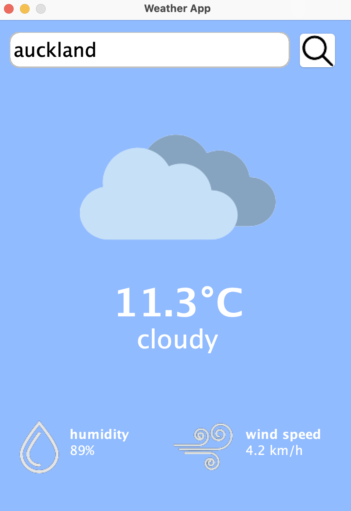

# Weather App
Welcome to Weather App! This application provides accurate and up-to-date weather information with a user-friendly graphical interface.

<div align="center"> 
	 </div>

## Features

- Real-time weather updates.
- Detailed weather forecasts.
- Support for multiple cities.

## Installation

To get started with WeatherApp, follow these steps:

1. **Clone the repository:**

    ```bash
    git clone https://github.com/username/weatherapp.git
    cd weatherapp
    ```

2. **Install dependencies:**

    ```bash
    // Assuming dependencies are managed using a build tool like Maven or Gradle
    ./mvnw install
    ```

3. **Run the application:**

    ```bash
    java -jar target/weatherapp-1.0.0.jar
    ```


## Contact

If you have any questions or feedback, feel free to reach out:

- **Email:** [oorjagandhi@gmail.com](mailto:oorjagandhi@gmail.com)
